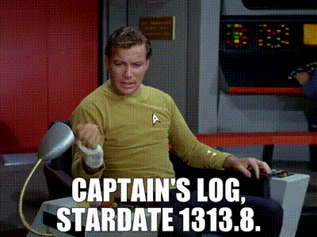
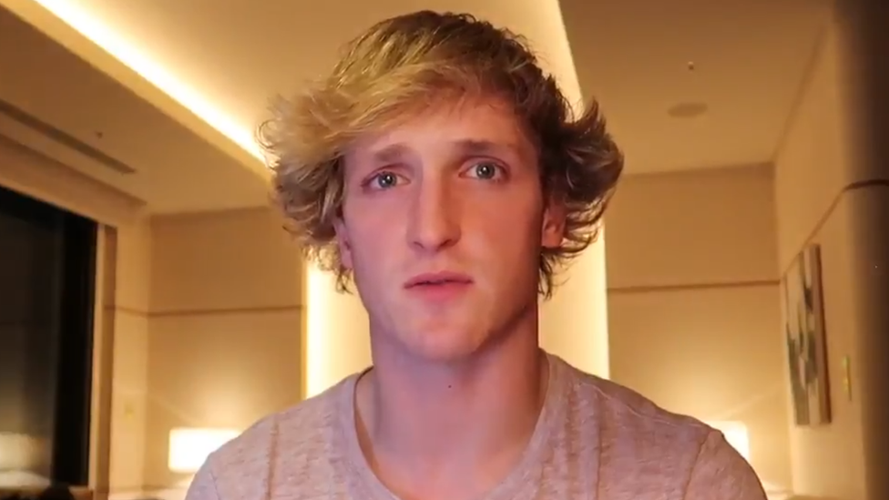
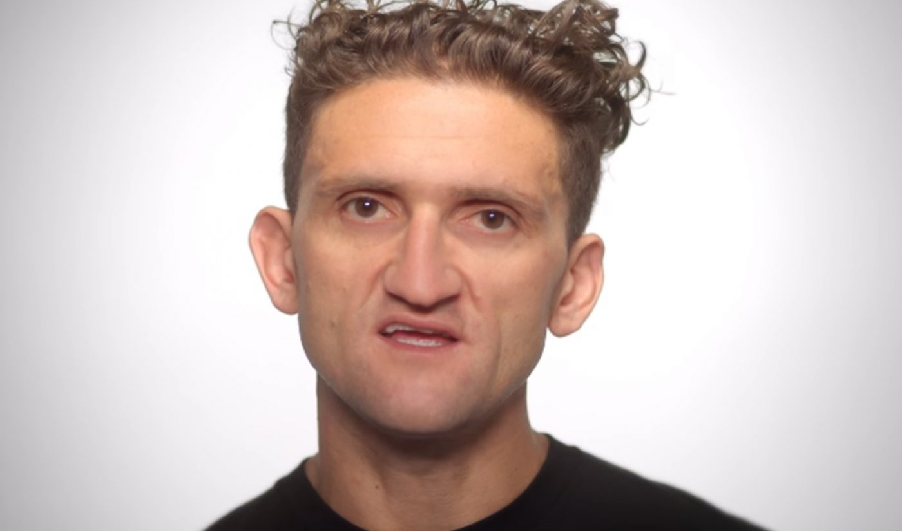

# The First Blog

### What is a blog?

Weblogs, or "blogs" as they have come to be known, were first used to log the progress of a website, either its development or tracking traffic, etc., much like a ship's log or captain's log would track the daily goings-on of a ship in the olden days.  It has since evolved to mean a centralized hub for articles over a specific topic, from a specific author, and sourced on the web.

There are spinoffs of blogs, such as "Vlogs" (video logs), which were popularised on Youtube by creators such as Casey Neistat and Logan Paul. 

### Why Blog?

The purpose of this blog is to share my thoughts, ideas, opinions, life accomplishments/goals, funny stories, or anything else that intrigues me. This is not a professional or commercial blog; I don't seek anything but my own enjoyment. I hope that you find enjoyment in this creative endeavor as well. I encourage you to start your own blog as well and share your thoughts and feelings with the world!

### Was this inspired by the hit T.V. show 'Dog With A Blog'?

...yes.

###### References

<ul style="color: grey; font-size: .7rem;">
<li>I found these images on the web</li>
<li>I'll make actual references in the future</li>
<li>Ok goodbye now</li>
</ul>
